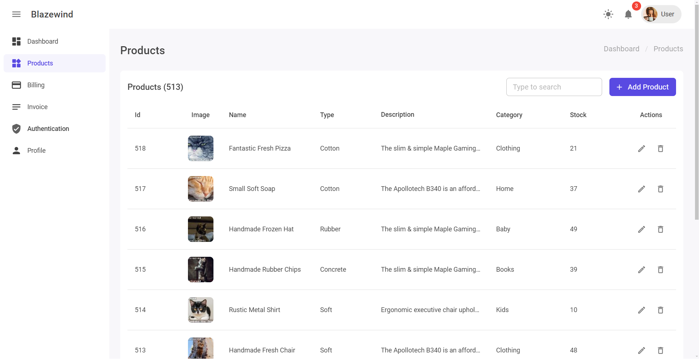

<h2 align="center">Blazewind - An Open Source Blazor Admin Template</h2>

<h4 align="center">:warning: Work in Progress :warning:</h4>

This project is a Blazor WebAssembly hosted dashboard template that combines the power of MudBlazor and Tailwind CSS.
It serves as an excellent starting point for building interactive dashboards. Notably, there are currently limited options for MudBlazor-based templates,
so this project aims to fill that gap and inspire the Blazor community to create more open-source dashboard templates.

## :heart: Preview

## :sparkles: The Dashboard Template Contains These Pages

- Dashboard (Home) Page
- Products Page
- Invoice Page
- Billing Page
- Profile Page

## :package: List of Packages and Projects Used to Design this Template

- Mudblazor
- Tailwind CSS
- Bogus (For generating data placeholders)
- Blazor Apex Charts
- Morris Blazor Validation
- BlazorComponentBus (For communicating between components)

> [!NOTE]  
> These pages are not final and I'll add more as I work on this project,
> you can also suggest what pages you think are worth including in this template.

## :tada: Special Thanks

The awesome people at Jetbrains have provided
Licenses to their IDE's to support development of this open-source project.
Thanks Jetbrains!

